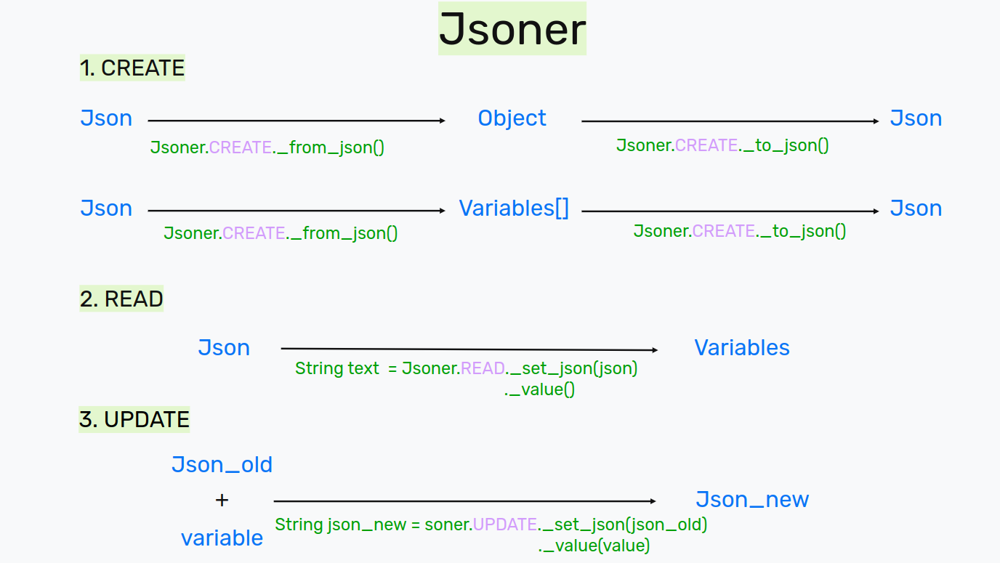

# Jsoner

[⬅️LTS](../../README.md)

## Create

```Jsoner.CREATE``` - It can convert Java to Json and vice versa.

### From object

Input:

```java
public static void main(String[] args) {

    List<Studys> list = new ArrayList<>();
    list.add(new Studys("MGU_1", 2020));
    list.add(new Studys("MGU_2", 2024));

    User user = new User();
        user.setName("bufferum");
        user.setAge(20);
        user.setCharacter_traits(new String[] { "Kind", "Wit", "Brave" } );
        user.setStudys(list);

    String json = Jsoner.CREATE._to_json(user);
    System.out.print(json);

}
```

Output:

```json
{
    "name": "bufferum",
    "age": 20,
    "studys": [
        {
            "educational_institution": "MGU_1",
            "year_of_completion": 2020
        },
        {
            "educational_institution": "MGU_2",
            "year_of_completion": 2024
        }
    ],
    "character_traits": [
        "Kind",
        "Wit",
        "Brave"
    ]
}
```

### From variables

Input:

```java
public static void main(String[] args) {

    String json = Jsoner.CREATE
            ._set("name", "bufferum")
            ._set("age", 20)
            ._set("IQ", 2999.9999)
        ._to_json();

    System.out.print(json);

}
```

Output:

```json
{
    "name": "bufferum",
    "age": "20",
    "IQ": "2999.9999"
}
```

## READ

Input:

```java
public static void main(String[] args) {
    String json = """
        {
            "name": "bufferum",
            "age": "20",
            "IQ": "2999.9999"
        }
    """;

    String result = Jsoner.READ._set_json(json)
                            ._value("age");

    System.out.print("Value: " + String.valueOf(result));
}
```

Output:

```plaintext
Value: 20
```

## UPDATE

Input:

```java
public static void main(String[] args) {
    String json_old = """
        {
            "name": "bufferum",
            "age": "20",
            "IQ": "2999.9999"
        }
    """;

    String json_new = Jsoner.UPDATE._set_json(json_old)
                                ._value("age", 30)
                                ._get_json();

    System.out.print(json);

}
```

Output:

```json
{
    "name": "bufferum",
    "age": "30",
    "IQ": "2999.9999"
}
```

## FORMAT

```Jsoner.FORMAT``` - It can convert unstructured json to structured json and vice versa.

Input:

```java
public static void main(String[] args) {

    String json_destructuring =

    "[{"identifier":{"id":"zerodind.familiar-java-themes","uuid":"e3fe11c9-03ad-4c91-93fc-d3aba5145a1e"},"version":"0.1.7","location":{"$mid":1,"path":"/c:/Users/bufferum/.vscode/extensions/zerodind.familiar-java-themes-0.1.7","scheme":"file"},"relativeLocation":"zerodind.familiar-java-themes-0.1.7","metadata":{"id":"e3fe11c9-03ad-4c91-93fc-d3aba5145a1e","publisherId":"1a0b1406-1928-4fa9-ae0d-8cf45ddbe82a","publisherDisplayName":"0dinD","targetPlatform":"undefined","updated":false,"isPreReleaseVersion":false,"installedTimestamp":1685239906995,"preRelease":false}}]";

    String json_structuring = Jsoner.FORMAT._structuring(json_destructuring);

    System.out.print(json_structuring);

}
```

Output:

```json
[
{
    "identifier": {
    "id": "zerodind.familiar-java-themes",
    "uuid": "e3fe11c9-03ad-4c91-93fc-d3aba5145a1e"
    },
    "version": "0.1.7",
    "location": {
    "$mid": 1,
    "path": "/c:/Users/bufferum/.vscode/extensions/zerodind.familiar-java-themes-0.1.7",
    "scheme": "file"
    },
    "relativeLocation": "zerodind.familiar-java-themes-0.1.7",
    "metadata": {
    "id": "e3fe11c9-03ad-4c91-93fc-d3aba5145a1e",
    "publisherId": "1a0b1406-1928-4fa9-ae0d-8cf45ddbe82a",
    "publisherDisplayName": "0dinD",
    "targetPlatform": "undefined",
    "updated": false,
    "isPreReleaseVersion": false,
    "installedTimestamp": 1685239906995,
    "preRelease": false
    }
}
]
```

## Jsoner scheme


