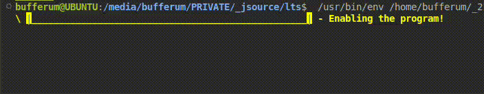

# Progress_bar

[⬅️LTS](../../README.md)

This class is used to visualize the completion of a task in stages.
Create an instance of this class, pass an array with descriptions, and send a signal using the `_send_signal` method.

Attention!!!
There should be exactly as many signals as there are elements in the `description` array.

```java
public static void main(String[] a) {

    String[] descriptions = {
        "Enabling the program!",
        "Simulation of operation 1",
        "Simulation of operation 2",
        "Simulation of operation 3",
        "Disabling the program!"
    };
    Progress_bar progress_bar = new Progress_bar();
    progress_bar._start(new Runnable() {

        @Override
        public void run() {

            // Task_1
            try { Thread.sleep(2000); }
            catch(InterruptedException e) { e.printStackTrace(); }
            progress_bar._send_signal();

            // Task_2
            try { Thread.sleep(2000); }
            catch(InterruptedException e) { e.printStackTrace(); }
            progress_bar._send_signal();

            // Task_3
            try { Thread.sleep(2000); }
            catch(InterruptedException e) { e.printStackTrace(); }
            progress_bar._send_signal();

            // Task_4
            try { Thread.sleep(2000); }
            catch(InterruptedException e) { e.printStackTrace(); }
            progress_bar._send_signal();

            // Task_5
            try { Thread.sleep(2000); }
            catch(InterruptedException e) { e.printStackTrace(); }
            progress_bar._send_signal();

        }


    }, descriptions);

}
```

```java
try { Thread.sleep(2000); }
catch(InterruptedException e) { e.printStackTrace(); }
```

This code simulates a download. But this is only used as an example. You don't need to use this delay to actually use the Progress_bar code.


